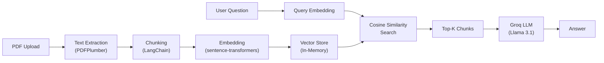

# AI-PDF-Chatbot

> An intelligent RAG-powered chatbot that answers questions from your PDF documents using local embeddings and Groq's Llama 3.1 model.


---

## About

**AI-PDF-Chatbot** is a Retrieval-Augmented Generation (RAG) chatbot built by **Ibrahim**. Upload any PDF — admission guides, research papers, FAQs, manuals — and ask questions in plain English. The chatbot retrieves the most relevant sections from your document and generates concise, accurate answers using AI.

### Why I Built This

Students and professionals constantly deal with long PDF documents and need quick, specific answers. Instead of scrolling through pages, this chatbot lets you have a conversation with your documents. I collected FAQs from 20+ university websites, combined them into a single PDF, and built this tool to handle repetitive questions automatically.

---

## Features

- **PDF Upload & Parsing** — Upload any PDF and the chatbot extracts its content using PDFPlumber.
- **Smart Chunking** — Documents are split into overlapping chunks for better context retrieval.
- **Local Embeddings** — Text is embedded locally using `sentence-transformers` (all-MiniLM-L6-v2) — no external API needed for this step.
- **Semantic Search** — Finds the most relevant chunks using cosine similarity.
- **AI-Powered Answers** — Generates concise responses via Groq's Llama 3.1 8B model (free tier).
- **Embedding Cache** — Re-uploads of the same PDF are instant thanks to hash-based caching.
- **Two Interfaces** — Streamlit UI (v1) and Flask web app (v2) included.

---

## Tech Stack

| Technology | Purpose |
|---|---|
| **Python** | Core language |
| **Streamlit** | Interactive web UI (v1) |
| **Flask** | Web server (v2) |
| **LangChain** | Document loading and text splitting |
| **PDFPlumber** | PDF text extraction |
| **sentence-transformers** | Local embedding generation |
| **scikit-learn** | Cosine similarity for retrieval |
| **NumPy** | Numerical operations |
| **Groq API** | LLM inference (Llama 3.1 8B) |

---

## Architecture



---

## Project Structure

```
AI-PDF-Chatbot/
├── AI_PDF_Chatbot.py        # Streamlit app (main entry point)
├── requirements.txt          # Python dependencies
├── .env.example              # Environment variable template
├── .gitignore
├── LICENSE
├── README.md
└── v2/                       # Flask-based web interface
    ├── app.py                # Flask server
    ├── pipeline.py           # RAG pipeline with SPARQL + LLaMA
    └── templates/
        └── index.html        # Chat UI
```

---

## Getting Started

### Prerequisites

- Python 3.10 or higher
- A free [Groq API key](https://console.groq.com/keys)

### 1. Clone the Repository

```bash
git clone https://github.com/muhammad-ibrahim-butt/AI-PDF-Chatbot.git
cd AI-PDF-Chatbot
```

### 2. Install Dependencies

```bash
pip install -r requirements.txt
```

### 3. Configure Environment Variables

```bash
cp .env.example .env
```

Open `.env` and replace `your-groq-api-key-here` with your actual Groq API key.

> The `.env` file is gitignored and will never be pushed to GitHub.

### 4. Run the App

```bash
streamlit run AI_PDF_Chatbot.py
```

The app will open at [http://localhost:8501](http://localhost:8501).

---

## How It Works

1. **Upload** a PDF file through the Streamlit interface.
2. The chatbot **extracts** text and **splits** it into overlapping chunks (1500 chars, 200 overlap).
3. Each chunk is converted into an **embedding vector** locally using sentence-transformers.
4. When you ask a question, the chatbot **embeds your query** and finds the **top 3 most similar chunks** via cosine similarity.
5. The relevant chunks and your question are sent to **Groq's Llama 3.1** model, which generates a concise answer.

---

## Future Roadmap

- [ ] Human handoff when the AI cannot answer confidently
- [ ] Voice input support for hands-free interaction
- [ ] Mobile-friendly responsive interface
- [ ] Multi-language support (including Urdu)
- [ ] Persistent vector store for multi-session document memory

---

## License

This project is licensed under the [MIT License](LICENSE).

---

## Author

Built by **Ibrahim**

[](https://github.com/muhammad-ibrahim-butt)
